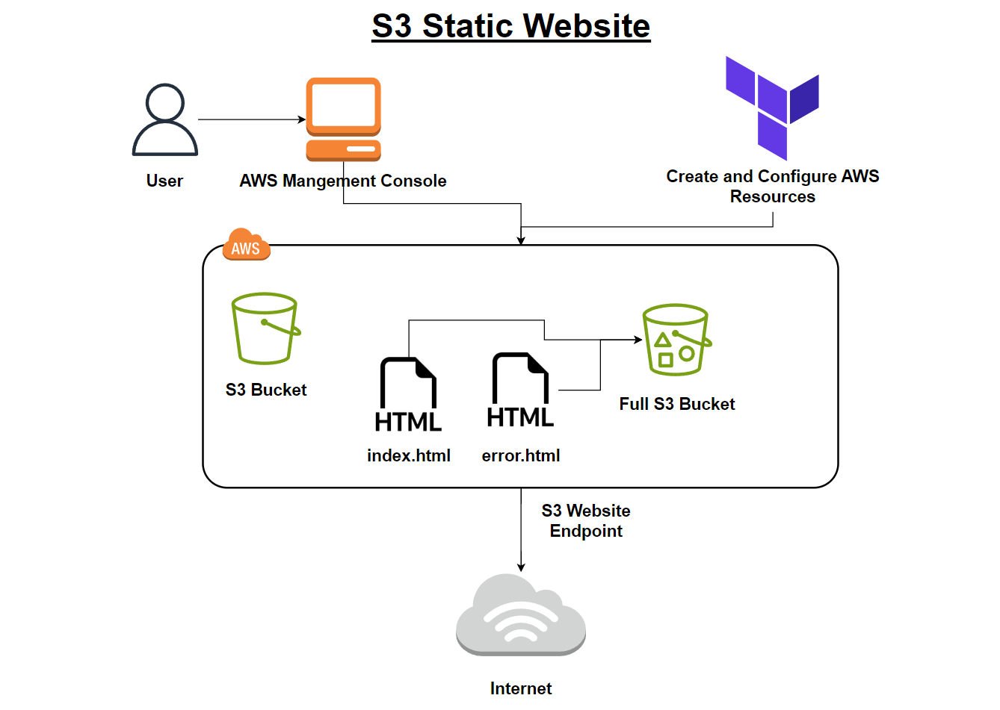

## About The Project

Creating an automation of creating and hosting a static website in AWS S3 bucket.


### Key features of this project:
- Terraform
- AWS
- HTML
- CSS


### Built With
The project is built with Terraform:

[![Terraform][Terraform]][Terraform-url] 


<!-- Getting Started Section -->
## Getting Started
To get started, follow the steps below:


<!-- Requirements Section -->
### Requirements

- AWS account
- Terraform

  
<!-- Installation Section -->
### Installation

Clone the repository:

   ```bash
   git clone https://github.com/Daniel-Shwartzman/Terraform-AWS-S3-StaticWebsite.git
   cd Terraform-AWS-S3-StaticWebsite
   ```


## Setup

### Download Terraform

1. Click on the Terraform button above and you will enter the Terraform website.
2. Install Terraform from the site.
3. Add the path of the downloaded directory to the path environment variable.

#### In the command line type the following:
```bash
terraform init
terraform apply
```

#### For deleting type:
```bash
terraform destroy
```


## Notes
1. Make sure you added the path of the downloaded directory to the path environment variable.
2. Make sure you set a unique bucket name to avoid errors.


### Architecture:



<!-- MARKDOWN LINKS & IMAGES -->
[Terraform]: https://img.shields.io/badge/Terraform-623CE4?style=for-the-badge&labelColor=black&logo=terraform&logoColor=623CE4
[Terraform-url]: https://registry.terraform.io/
